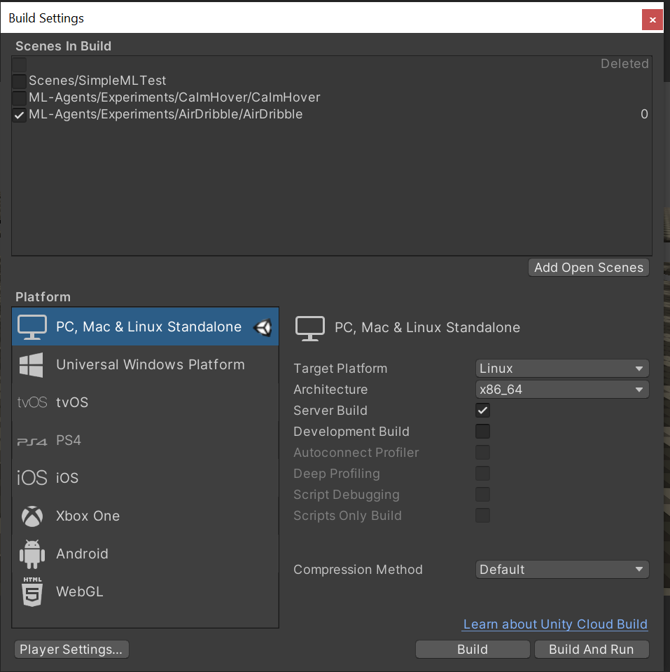

# Roboleague auf Lido lernen lassen

## Anleitung

* lokal das Lernen testen, um spätere Fehler auf lido zu vermeiden
* nach erfolgreichen lokalen Test ein Build der Umgebung für Linux erstellen
  * falls diese Option unter File->BuildSettings nicht vorhanden ist, dann muss diese
    erst nachinstalliert werden.
  * Build nach dem Bild konfigurieren
    
    
  * Build speichern und mit einer Configuration für mlagents in eine komprimierte Datei packen.
* Datei hochladen und entpacken
* im runscript.sh gegebenenfalls .yaml Dateiname und weitere Parameter anpassen
* mit sbatch runscript.sh das lernen starten
  * das Script speichert vor Ende der Laufzeit die Ergebnisse ab. Diese können exportiert werden 
    oder mit dem flag --resume weiter gelernt werden

  .onnx Datei kann in Unity importiert werden, um sich die Ergebnisse anzugucken