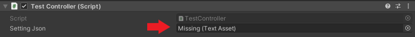

# RoboLeague Repository
 
 ## Tests ausführen
 
 Um Tests auszuführen, muss man in der settings json den absoluten Pfad zur Konfiguration für den Physikabgleich setzen. Aus der Json werden folgende Informationen gesammelt:
 * Absoluter Pfad zum Szenarienordner
 * Absoluter Pfad zum Testergebnisse speichern
 * Name des auszuführenden Szenarios
 
 Diese Json muss in Unity unter Im Testszenario unter env beim Test Controller hinzugefügt werden.
 
 
 Zum Ausführen den TestController aktivieren und die Szene starten.
 In der Konsole warten, bis die json gespeichert worden ist.
